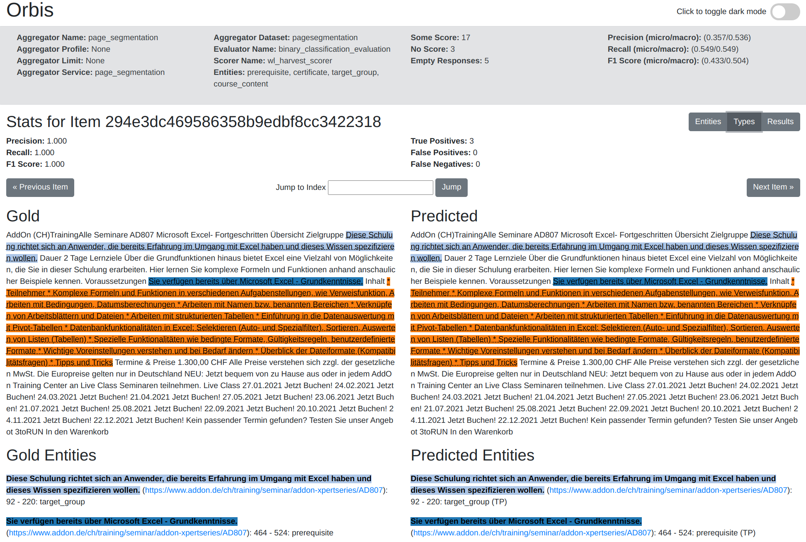

# HTML Pages Storage Plugin for Orbis

This plugin generates an HTML web page for each gold document with the corresponding results of the service.



## Show clustering

In order for the cluster to be displayed, the following element must be added to all dictionaries in the array returned in the aggregation step in the ```map_entities``` function.   

```python
{
    "annotations": [{"type": "Cluster", "entity": cluster_name}],
                }
```